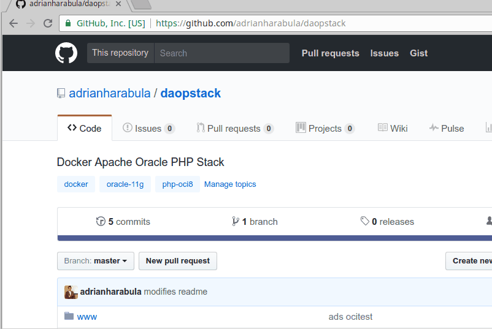

# Docker Apache Oracle PHP Stack
daopstack

## Instructions

Run this with:
```
git clone https://github.com/adrianharabula/daopstack
cd daopstack
docker-compose up -d

```

## Sample how to run



To stop the instance currently running:
```
docker-compose stop
```

To remove the instance run (Warning! This removes any changes made to oracle database!):
```
docker-compose down
```

## SQL Developer access
To access the database with Oracle SQL Developer use these:
```
host:localhost
port:1525 # Warning: default port is 1521, but this way it won't interfere if there is already a oracle db installed on your system, you can run both db at the same time
user:system
pass:oracle
```

## Test
Test connectivity with database with [localhost:81/ocitest.php](http://localhost:81/ocitest.php)

## More info
It uses the following images, click on the links for more info about them:
 * for database [wnameless/oracle-xe-11g](https://hub.docker.com/r/wnameless/oracle-xe-11g/).
 * for Apache, PHP and OCI8 [adrianharabula/php7-with-oci8](https://hub.docker.com/r/adrianharabula/php7-with-oci8)

# Contact
Any problem and sugestions can be sent to adrian.harabula@gmail.com.